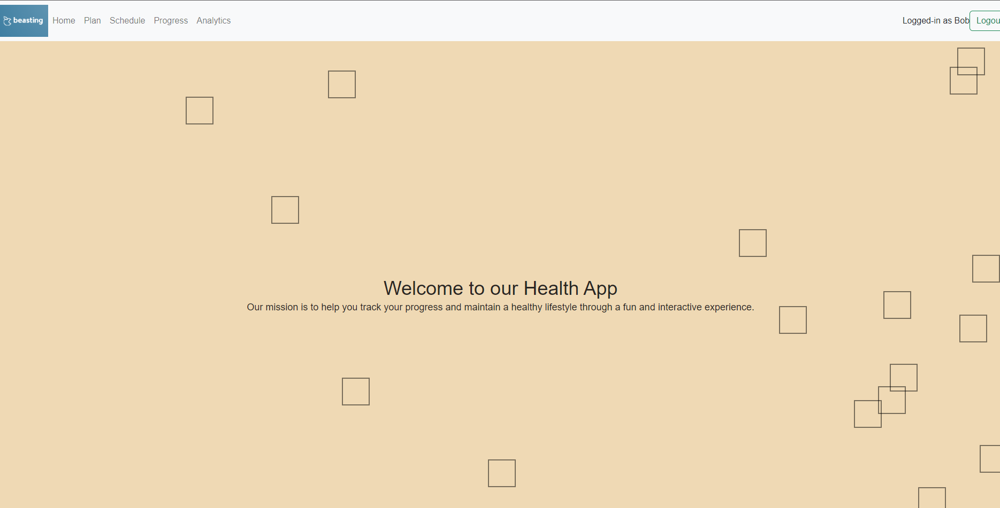
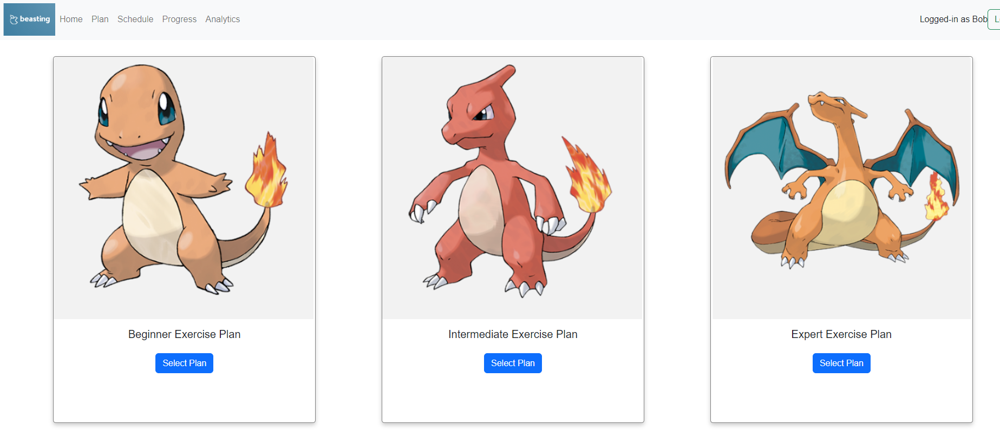
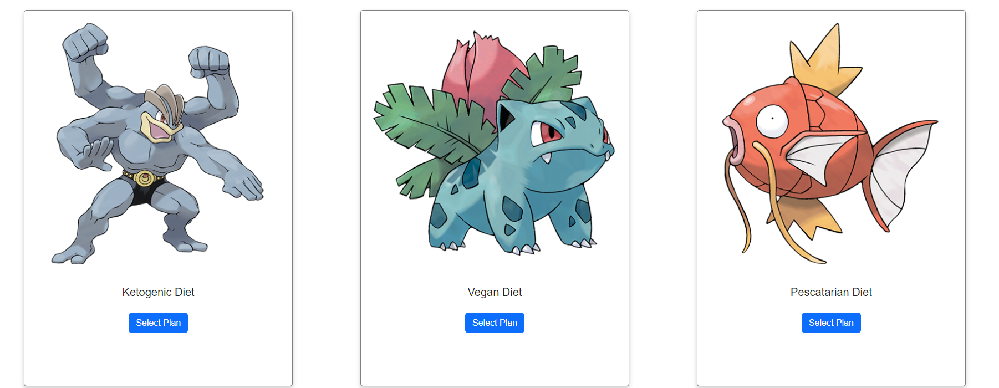
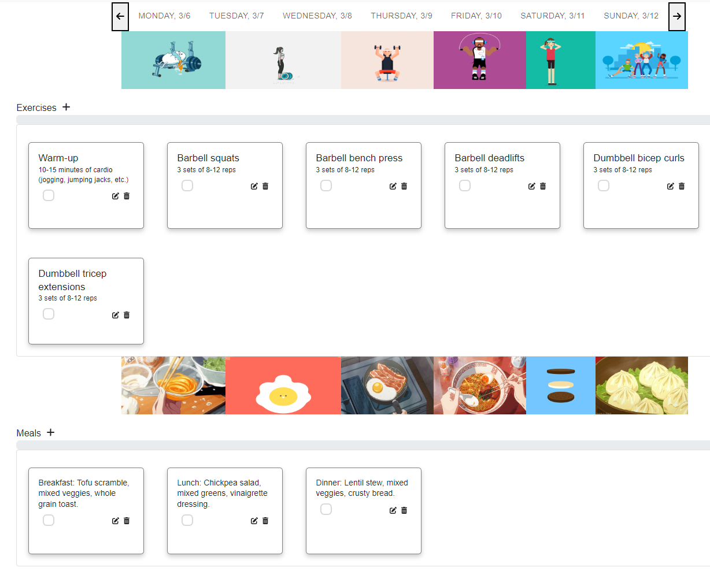
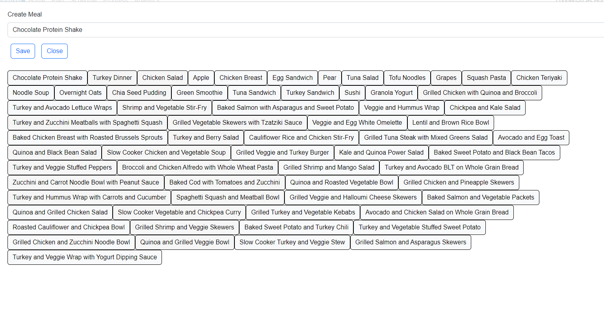
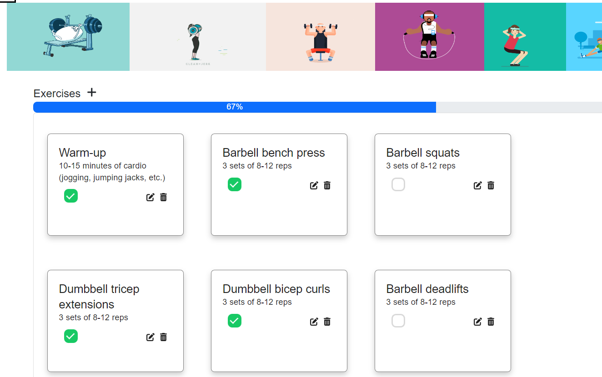
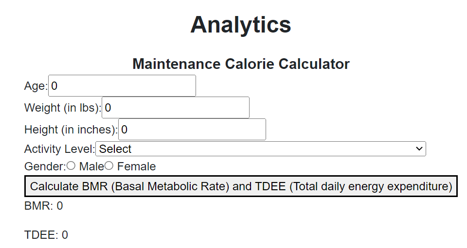

# Workout Schedhuling app
This health app can help users make healthier choices each day by enabling them to track their progress, view personalized dashboards, add new workouts or exercises, and analyze their basal metabolic rate and daily energy expenditure.  It includes a PostgreSQL, Express, and Node.js backend, with a React frontend employing Bootstrap and MaterialUI packages.

## Setup

### Setting up our Client
Install React dependencies with `npm install` in root directory.

Add an .env file with a variable "PORT=8000"  

### Setting up our server
In a seperate terminal, navigate to the server folder and initialize the server dependencies and .env file

```sh
cd server/server_API
npm install
touch .env
```
To the .env file, add The following with the appropriate PostgreSQL database settings, database port number and server port number

```sh
  DB_HOST=localhost
  DB_USER=username
  DB_PASS=password
  DB_NAME=name
  DB_PORT=port-number
  PORT=8080
```
# Setting up our Database
In a third seperate terminal, navigate to the root directory and run the following
```sh
  cd server/server_API
  \psql
  CREATE DATABASE workout
  \c workout
```

Add our initial database migrations and seeds

```sh
  \i db/schema.sql;
  \i db/seeds/exercises;
  \i db/seeds/meals.sql;
  \i db/seeds/meals_tracker.sql;
  \i db/seeds/exercise_tracking.sql;
  \i db/seeds/users.sql; 
```
## Run the client and back-end server 

To run the client React server, in the root directory run:
```sh
npm start
```

In a seperate terminal navigate to the root folder then run the following:
```sh
cd server/server_API
npm start
```


## Screenshots



Choose from preset plans


Plans and exervises are added to your routine

Add custom exercises and meals

Track your progress

